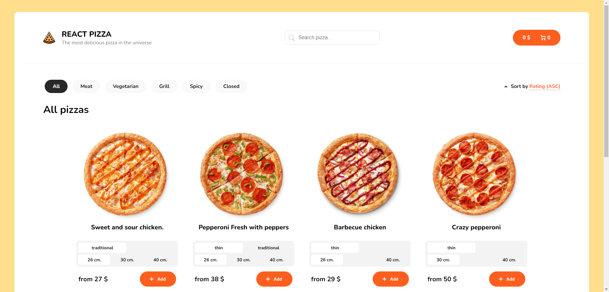

<div id="top"></div>

<!-- PROJECT LOGO -->
<br />
<div align="center">

<h3 align="center">React Pizza</h3>

  <p align="center">
    <!-- <a href="https://freekson.github.io/React-Pizza/">View Demo</a> -->
    <a href="https://github.com/Freekson/React-Pizza/issues">Report Bug</a>

  </p>
</div>

<!-- TABLE OF CONTENTS -->
<details>
  <summary>Table of Contents</summary>
  <ol>
   <li>
      <a href="#about-the-project">About The Project</a>
    </li>
    <li><a href="#stack">Stack</a></li>  
    <li><a href="#preview">Preview</a></li> 
    <li><a href="#instalation">Installation</a></li>
    <li><a href="#contact">Contact</a></li>
  </ol>
</details>

<!-- ABOUT THE PROJECT -->

# About The Project

### Welcome to the React Pizza!

This is a small-scale project that showcases the implementation of a pizza ordering platform using React and TypeScript.

### Key Features

**Technologies Used**: React, TypeScript, Redux-toolkit  
**Data Handling**: Utilizes JSON-server to simulate API requests for pizza data.  
**Dynamic Filtering**: Implements dynamic pizza filtering based on various attributes.  
**URL Persistence**: Demonstrates the process of maintaining filter states in the URL.  
**Shopping Cart**: Incorporates a shopping cart system for adding selected pizzas.

<div id="stack"></div>

# Tech Stack Used

- ReactJS
- React Router
- React Skeleton
- React Hooks
- TypeScript
- SCSS-Modules / SASS(SCSS syntax) for styling
<!-- GETTING STARTED -->

# Preview

_Some gifs may take a long time to load, if you want to see them wait a bit._

**Main page**



**Filters preview**


**Cart preview**


<div id="instalation"></div>

# Installation

1. Clone the repo
   ```sh
   git clone https://github.com/Freekson/React-Pizza.git
   ```
2. Go to React-Pizza folder
   ```
   cd React-Pizza
   ```
3. Install NPM packages
   ```sh
   npm install
   ```
4. Run server command
   ```sh
   npm run dev
   ```

See the [open issues](https://github.com/Freekson/React-Pizza/issues) for a full list of proposed features (and known issues).  
Check the [releases](https://github.com/Freekson/React-Pizza/releases) to see completed items

<!-- CONTACT -->

# Contact

Yehor Dreval

- [Instagram](https://www.instagram.com/freeksons)
- [Telegram](https://t.me/freekson)
- [Linkedin](https://www.linkedin.com/in/yehor-dreval-1634b4207/)

Project Link: [React pizza](https://github.com/Freekson/React-Pizza)

<p align="right">(<a href="#top">Back to top</a>)</p>
